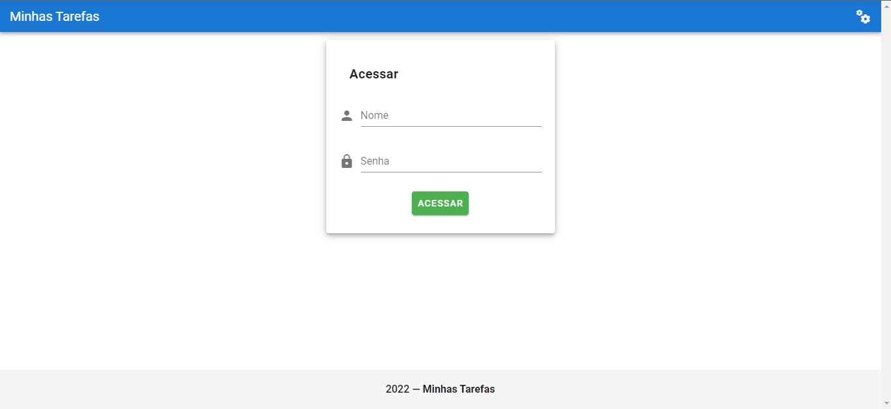
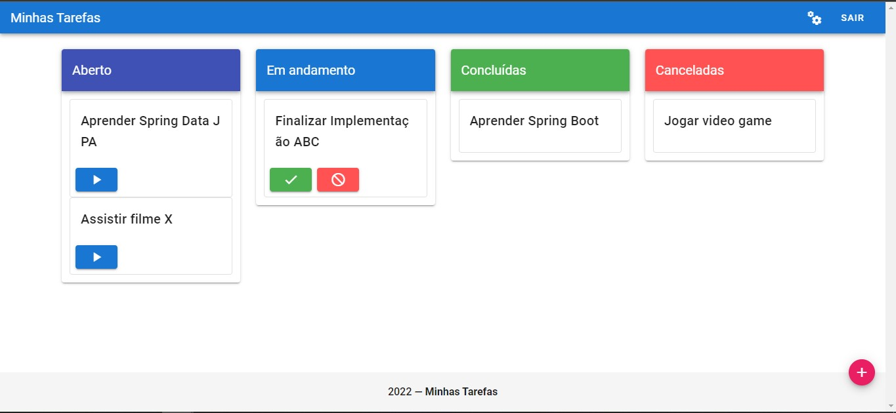
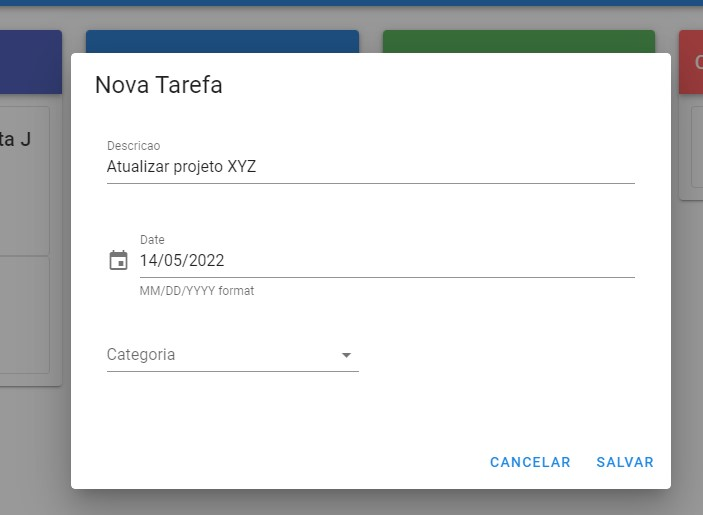

# Minhas Tarefas

## Layout web

  

  

  

### Passos para a instalação na sua máquina
<b>1 - Clonar o repositório</b>

git clone git@github.com:Jordanrafael92/MyWorks.git

<b>2 - Na pasta Frontend, fazer as dependências:</b>
	
- Instalar o node: npm install 

  
- npm run build 

<b>3 - Subir o backend</b>

<b>4 - Rodar o frontend e verificar se a aplicação esta comunicando com o backend</b>
	
- No diretório frontend, executar o seguinte comando: npm run serve

<b>5 - A aplicação iniciará automaticamente no navegador, no endereço:</b>

http://localhost:8081/login

Usuário: Admin

Senha: 123456

## Developer
Jordan Silva

https://www.linkedin.com/in/jordan-silva/
